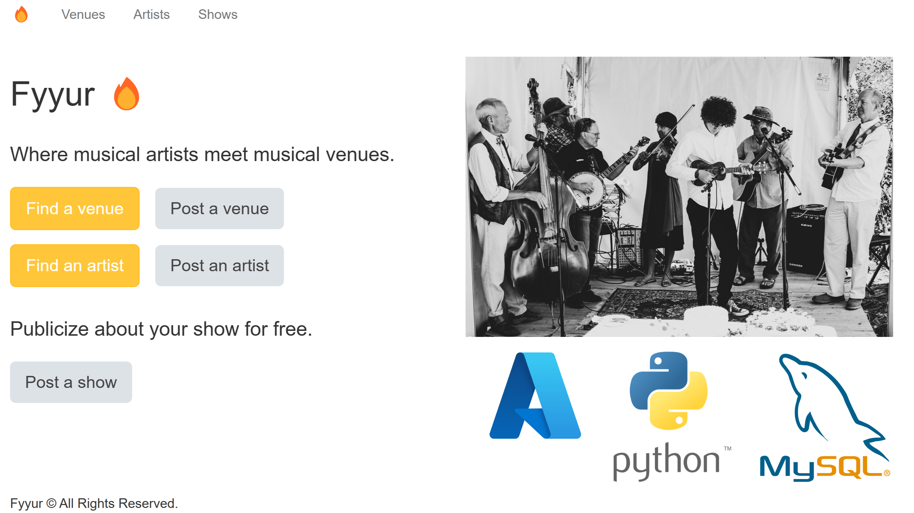
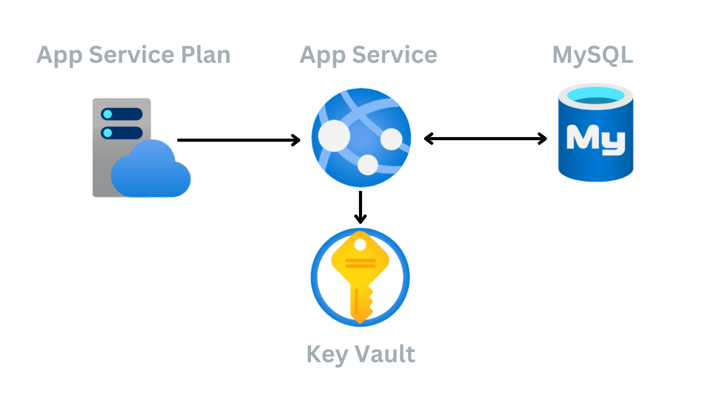

# Fyyur App

Artists Booking Venues powered by Python (Flask) and MySQL Database.
There is no user authentication or per-user data stored.



The project is designed for deployment on Azure App Service with a MySQL flexible server. See deployment instructions below.



## Local Development

1. **Download the project starter code locally**

  ```bash
  git clone https://github.com/john0isaac/flask-webapp-mysql-db.git
  cd flask-webapp-mysql-db
  ```

2.**Initialize and activate a virtualenv using:**

```bash
python -m virtualenv venv
source venv/bin/activate
```

>**Note** - In Windows, the `venv` does not have a `bin` directory. Therefore, you'd use the analogous command shown below:

```bash
source venv/Scripts/activate
deactivate
```

3.**Install the dependencies:**

```bash
pip install -r requirements.txt
```

4.**Run the development server:**

```bash
export FLASK_APP=app.py
export FLASK_ENV=development
export FLASK_DEBUG=true
flask run --reload
```

5.**Verify on the Browser**

Navigate to project homepage [http://127.0.0.1:5000/](http://127.0.0.1:5000/) or [http://localhost:5000](http://localhost:5000)

## Deployment

This repository is set up for deployment on Azure App Service (w/MySQL flexible server) using the configuration files in the `infra` folder.

To deploy your own instance, follow these steps:

1. Sign up for a [free Azure account](https://azure.microsoft.com/free/)

2. Install the [Azure Dev CLI](https://learn.microsoft.com/azure/developer/azure-developer-cli/install-azd). (If you open this repository in Codespaces or with the VS Code Dev Containers extension, that part will be done for you.)

3. Initialize a new `azd` environment:

    ```shell
    azd init
    ```

    It will prompt you to provide a name (like "flask-app") that will later be used in the name of the deployed resources.

4. Provision and deploy all the resources:

    ```shell
    azd up
    ```

    It will prompt you to login, pick a subscription, and provide a location (like "eastus"). Then it will provision the resources in your account and deploy the latest code. If you get an error with deployment, changing the location (like to "centralus") can help, as there may be availability constraints for some of the resources.

5. When azd has finished deploying, you'll see an endpoint URI in the command output. Visit that URI to browse the app! 🎉

6. If you make any changes to the app code, you can just run this command to redeploy it:

    ```shell
    azd deploy
    ```
